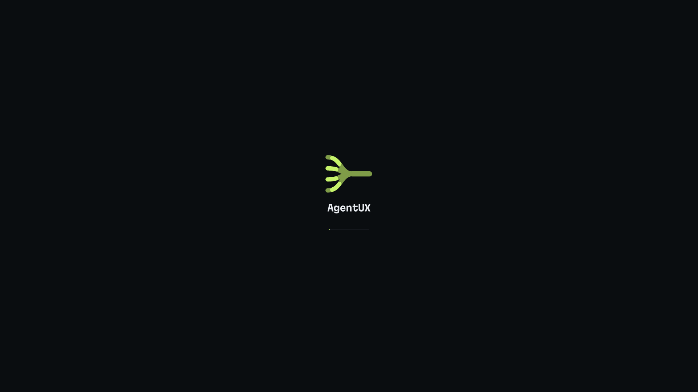
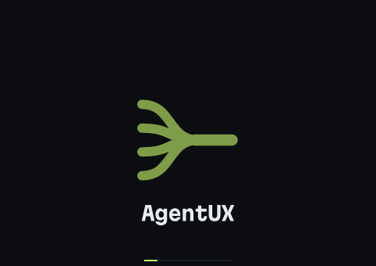
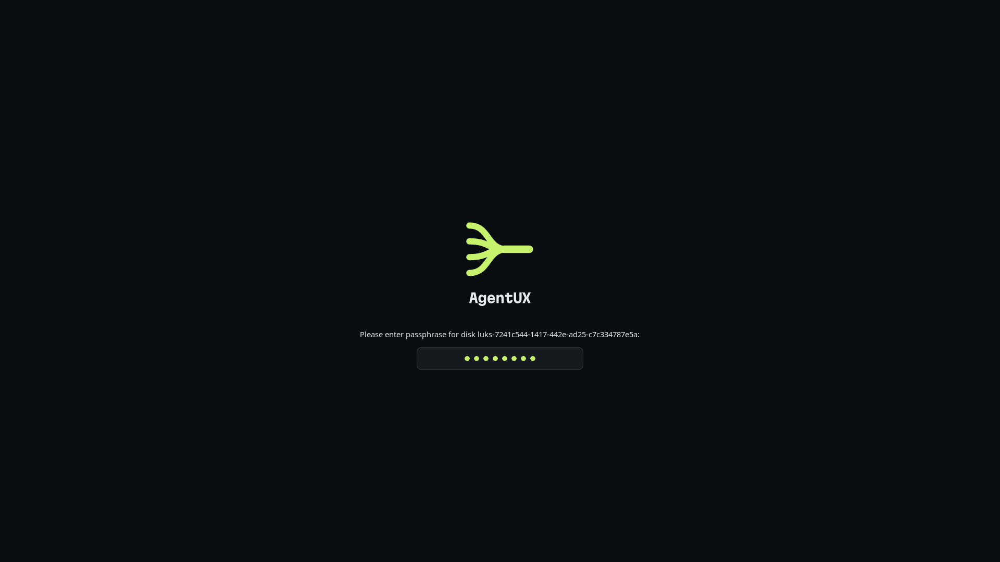

# agentux-os

The [AgentUX](https://github.com/agentux-os/agentux) Linux distribution image: a [bootc](https://containers.github.io/bootc/) image on Fedora Atomic (Kinoite, KDE Plasma), defined by a single `Containerfile` and built by CI for **x86_64 (amd64) and aarch64 (arm64)**.

> **Status:** bootstrapping. See [ADR 0001](https://github.com/agentux-os/agentux/blob/main/docs/adr/0001-linux-distribution-on-fedora-atomic.md) for the design.

## Architectures

`ghcr.io/agentux-os/agentux` is a multi-arch image: each tag is a manifest list with a `linux/amd64` and a `linux/arm64` image, and `podman pull`, `bootc switch` and `bootc upgrade` pick the one for the machine they run on. CI builds each natively (GitHub's `ubuntu-24.04` and `ubuntu-24.04-arm` runners, no emulation) from the same `Containerfile`, which installs the AgentUX RPMs for the build's architecture (`uname -m`). The arm64 image targets UEFI machines that Fedora supports on aarch64 (SystemReady servers and workstations, VMs on Apple silicon or Ampere hosts); boards that need their own firmware or kernel are not covered.

## What the image contains

- **Base:** Fedora Kinoite — immutable `/usr`, atomic updates, previous image always bootable for rollback.
- **System toolchain:** `git`, `gh`, `ripgrep`, `fd`, `jq`, `bat`, `delta`, `just`, `uv`, Node.js, `mise`, Podman, Distrobox.
- **Coding agent CLIs:** Claude Code, Codex, OpenCode and Antigravity CLI, plus their [ACP](https://agentclientprotocol.com) adapters, installed per user on first login so each can keep itself up to date (`agentux-first-login.service` waits for NetworkManager to be online and, if a download fails, retries every 5 minutes, at most 4 times per hour, then again on the next login). Every step has a time budget (5 minutes per CLI) and every download a connect timeout and stall detection, and the unit's `TimeoutStartSec` (35 minutes) bounds the whole run, so a stuck server or vendor installer is killed and retried instead of hanging first login. Antigravity's ACP server (`agy-acp-server`, ~334 MB, ~1 GB unpacked) is not part of it: `agentux-antigravity-acp.service` installs it afterwards at idle CPU and I/O priority, so the CLIs are ready first. `/etc/profile.d/agentux.sh` puts `~/.local/bin` and mise's shims on every login shell's `PATH`.
- **AgentUX:** from [agentux-core](https://github.com/agentux-os/agentux-core), the `aux` CLI and the `agentuxd` daemon, which runs as a systemd user service enabled for every user (`systemctl --global enable agentuxd.service`, socket at `$XDG_RUNTIME_DIR/agentux/agentuxd.sock`; the packaged unit's `ConditionUser=!@system` keeps it out of system users' sessions, like the first-boot wizard's); from [agentux-desktop](https://github.com/agentux-os/agentux-desktop), the AgentUX Cockpit (`agentux-cockpit`) and the Plasma 6 defaults: the AgentUX global theme, wallpaper, login screen, panel layout, Meta+A / Meta+Return shortcuts and cockpit autostart (which skips system users, so nothing opens over the first-boot wizard), with Fedora's Welcome Center no longer opened at first login, all as system-wide defaults that each user can override.
- **User environment:** `/usr/lib/environment.d/60-agentux.conf` puts `~/.local/bin` and mise's shims on the `PATH` of the systemd user manager too, so user services (`agentuxd` and the agent CLIs it starts) and apps launched from Plasma (the cockpit) find the per-user tools, not only login shells.
- **Boot splash:** the AgentUX Plymouth theme, in the initramfs and on by default (see [Boot splash](#boot-splash)).
- **Identity:** the system calls itself AgentUX (see [Identity](#identity)).

## Identity

`/usr/lib/os-release` (`/etc/os-release` links to it) names the system AgentUX, as Universal Blue images do for theirs, so the first-boot wizard says "Powered by AgentUX", and the boot menu, `hostnamectl` and KDE's About this System show `AgentUX <date> (Fedora Linux 44 base)` with the AgentUX logo:

| Field | Value | Why |
|---|---|---|
| `NAME`, `PRETTY_NAME`, `VERSION` | `AgentUX`, `AgentUX <YYYYMMDD> (Fedora Linux 44 base)`, `<YYYYMMDD> (Fedora Linux 44 base)` | What people see. The date is the build's, as in the dated image tag; `--build-arg AGENTUX_VERSION=…` overrides it |
| `IMAGE_ID`, `IMAGE_VERSION` | `agentux`, `<YYYYMMDD>` | systemd's fields for image-based systems |
| `VARIANT`, `VARIANT_ID` | `Plasma`, `agentux` | |
| `LOGO` | `agentux` | The brand's app icon, installed as `agentux` in `hicolor` (16–256 px and scalable) and `/usr/share/pixmaps` |
| `HOME_URL`, `DOCUMENTATION_URL`, `SUPPORT_URL`, `BUG_REPORT_URL` | the agentux-os repositories | |
| `DEFAULT_HOSTNAME` | `agentux` | Hostname when none is set |
| `ANSI_COLOR` | Lime | systemd prints the name in it at boot |
| `ID`, `VERSION_ID`, `CPE_NAME`, `SUPPORT_END` (and `PLATFORM_ID`, which Fedora 44 does not set) | Fedora's (`fedora`, `44`, …), unchanged; the base image's os-release is kept as `/usr/share/agentux/os-release.base` and the build and tests compare against it | Tools key on these: bootc-image-builder picks its Fedora definitions by `ID`/`VERSION_ID`, dnf5 resolves `$releasever` from `VERSION_ID`, toolbox picks `fedora-toolbox:<VERSION_ID>` by `ID`, vulnerability scanners map `CPE_NAME` to Fedora's advisories. All of that is still true of this system, so they stay Fedora's (Bluefin and Aurora change `ID` and set `ID_LIKE=fedora` instead, and carry workarounds for it). Fedora sets no `ID_LIKE` |
| `REDHAT_BUGZILLA_PRODUCT*` | removed | Bug reports about this image belong to AgentUX, not Fedora's Bugzilla |

[`/etc/xdg/kcm-about-distrorc`](files/etc/xdg/kcm-about-distrorc) replaces Fedora's (which pointed at Fedora's logo) for KDE's About this System: the AgentUX logo, the AgentUX website, and `VERSION` instead of `VERSION_ID` next to the name. The build fails if the Fedora fields changed or the icon is missing; the smoke and boot tests check the fields again.

### AgentUX versions

The AgentUX components are installed from their GitHub releases, pinned in one place, the `ARG`s at the top of the AgentUX section of the [`Containerfile`](Containerfile). The image currently ships agentux-core 0.4.1 and agentux-desktop 0.4.1.

| Pin | What it selects |
|---|---|
| `AGENTUX_CORE_VERSION` | `agentux-<version>-1.fc44.<arch>.rpm` from agentux-core's `v<version>` release |
| `AGENTUX_DESKTOP_VERSION` | `agentux-cockpit-<version>-1.<arch>.rpm` and `agentux-plasma-<version>.tar.gz` (the same for both architectures) from agentux-desktop's `v<version>` release |
| `AGENTUX_PLASMA_SHA256` | sha256 of that Plasma tarball; the build fails if the download doesn't match |

`<arch>` is the build's `uname -m`, `x86_64` or `aarch64`; any other architecture fails the build. Both RPMs go through `dnf install`; the Plasma tarball (paths relative to `/`, only `usr/` and `etc/`) is extracted over `/` after the checksum check. To move to newer releases, run `just bump-agentux` (needs an authenticated `gh`): it takes the newest non-draft release of each repo, pre-releases included, checks that both releases have the `x86_64` and `aarch64` RPMs, rewrites the three pins from them (the checksum comes from the release's `.sha256` asset) and shows the diff to commit. A build with other versions without editing the file: `podman build --build-arg AGENTUX_CORE_VERSION=� .`. If a release ever changes the RPM's release number or Fedora tag (`-1.fc44`), update the file name in the `Containerfile` by hand.

## Boot splash



The boot splash is the brand's "messages on the bus": the mark sits dimmed on Ink, and short lit dashes run along its four lanes, reach the merge at the same moment and leave along the line as one. A Lime hairline under the wordmark is Plymouth's boot progress. Shutdown and reboot show the same screen with "Shutting down" or "Restarting" instead, and offline updates a progress line with a "don't turn off" note.



If the disk is encrypted, the passphrase prompt (LUKS, from the initramfs) takes the progress line's place, the mark lights up and holds still while it waits, and "Caps Lock is on" shows under the field when it is:



How it is built:

- The theme is [`files/usr/share/plymouth/themes/agentux/`](files/usr/share/plymouth/themes/agentux/), for Plymouth's script plugin (`plymouth-plugin-script`, which the image adds): [`agentux.script`](files/usr/share/plymouth/themes/agentux/agentux.script) and ~95 KB of PNGs. Everything is sized for 1080p and scales with the screen; each image comes at 1x and @2x, so 4K screens get sharp ones. It lays the screen out again when a display changes (the firmware framebuffer handing over to the GPU driver). The firmware's logo is not kept: the splash replaces it with the Ink screen.
- [`plymouth/build.py`](plymouth/build.py) draws the PNGs from the mark's geometry and the brand's `wordmark-mist.svg` (agentux repository, `brand/`) with resvg: `cd plymouth && npm install && python3 build.py`. Edit the script, not the PNGs.
- The `Containerfile` selects the theme (`plymouth-set-default-theme agentux`) and rebuilds the kernel's initramfs, `/usr/lib/modules/$kver/initramfs.img`, which is the one bootc boots: `dracut --no-hostonly --reproducible --add ostree`, as Universal Blue images do. The build fails if the theme or the script plugin is not in it.
- Plymouth shows a splash only when the kernel command line asks for one. Kinoite's image sets no kernel arguments (installers used to add `rhgb quiet`), so [`/usr/lib/bootc/kargs.d/10-agentux-splash.toml`](files/usr/lib/bootc/kargs.d/10-agentux-splash.toml) adds `rhgb quiet`; bootc applies it on install and on the next upgrade. To see boot messages instead, press Esc during boot, or remove them with `sudo rpm-ostree kargs --delete=rhgb --delete=quiet`.

To see it without installing: `python3 plymouth/preview.py` renders the animation from the theme's images (the GIF above), and [`plymouth/preview-vm.sh`](plymouth/preview-vm.sh) builds the `Containerfile`'s splash step on the base image and boots that kernel and initramfs in QEMU (software emulation in a container, no KVM, a few minutes) twice, once plain and once with a LUKS disk and a few keys typed into the prompt, saving a screenshot every half second to `output/plymouth-preview/`. The screenshots above come from it.

## Install

### From the ISO

The [Build ISO](https://github.com/agentux-os/agentux-os/actions/workflows/iso.yml) workflow turns the latest image into an Anaconda installer ISO per architecture with [bootc-image-builder](https://github.com/osbuild/image-builder/tree/main/bootc-image-builder), each built natively: `agentux-<date>-x86_64.iso` for PCs and `agentux-<date>-aarch64.iso` for 64-bit ARM UEFI machines. Download the one for your machine from the artifacts of a successful run, check it against the `.sha256` next to it, and write it to a USB stick:

```sh
sha256sum -c agentux-*.iso.sha256
sudo dd if=agentux-<date>-<arch>.iso of=/dev/sdX bs=4M status=progress oflag=sync
```

On ARM, boot the aarch64 ISO through the machine's UEFI firmware (or attach it as the CD of an aarch64 UEFI VM, e.g. UTM or Parallels on Apple silicon, or QEMU with `qemu-efi-aarch64`/`edk2-aarch64`).

The installer is interactive: you pick the disk, language and time zone and create your account. The installed system tracks `ghcr.io/agentux-os/agentux:latest` and updates from it.

### From an existing Fedora Atomic or bootc system

Switch to the latest image:

```sh
sudo bootc switch ghcr.io/agentux-os/agentux:latest
systemctl reboot
```

The same command works on x86_64 and aarch64: the tag is a manifest list and bootc pulls the image for the running architecture. Roll back with `sudo bootc rollback`.

## Verifying the image

Every image CI publishes is signed twice with [cosign](https://github.com/sigstore/cosign) before `:latest` moves to it, on every digest it publishes: the manifest list and the amd64 and arm64 images in it (a system checks the signature of the image for its architecture, not the list's):

- **keyless**, with the GitHub Actions identity of the build workflow on `main` (Fulcio certificate, recorded in the Rekor transparency log);
- with the **AgentUX signing key**, whose public half is in this repository and in the image at [`/etc/pki/containers/agentux-os.pub`](files/etc/pki/containers/agentux-os.pub).

Check either from any machine:

```sh
cosign verify ghcr.io/agentux-os/agentux:latest \
  --certificate-identity-regexp '^https://github\.com/agentux-os/agentux-os/\.github/workflows/build\.yml@refs/heads/main$' \
  --certificate-oidc-issuer https://token.actions.githubusercontent.com

cosign verify --key files/etc/pki/containers/agentux-os.pub ghcr.io/agentux-os/agentux:latest
```

That checks the list. To check one architecture's image, verify its digest from the list, e.g. for arm64:

```sh
digest="$(skopeo inspect --raw docker://ghcr.io/agentux-os/agentux:latest \
  | jq -r '.manifests[] | select(.platform.architecture == "arm64") | .digest')"
cosign verify --key files/etc/pki/containers/agentux-os.pub "ghcr.io/agentux-os/agentux@$digest"
```

### On installed systems

An installed system checks the key signature itself on every `bootc upgrade` and `bootc switch`, because the image ships:

- `/etc/containers/policy.json` with one entry added to Fedora's: `ghcr.io/agentux-os/agentux` requires a `sigstoreSigned` signature by `/etc/pki/containers/agentux-os.pub` (identity `matchRepository`, since cosign signs repositories, not tags). Every other registry keeps Fedora's rules, including the `insecureAcceptAnything` default.
- `/etc/containers/registries.d/agentux-os.yaml`, which turns on `use-sigstore-attachments` for `ghcr.io/agentux-os` so the signature is fetched from the registry.

An update that is unsigned or signed by another key is refused before any layer is downloaded, and the system stays on what it runs. The policy checks the key signature, not the keyless one: containers/image only matches Fulcio certificates by e-mail, and GitHub Actions certificates carry a workflow URI.

Systems installed from an image older than the signing change have no such policy yet. Nothing special is needed: the next `sudo bootc upgrade` brings an image with the policy (that one pull is not checked), and every pull after it is. If you changed `/etc/containers/policy.json` yourself, `/etc` keeps your version on updates; check that the entry is there:

```sh
jq '.transports.docker["ghcr.io/agentux-os/agentux"]' /etc/containers/policy.json
```

and add it by hand if it is not. Do not use `bootc switch --enforce-container-sigpolicy`: it refuses any policy whose default is `insecureAcceptAnything`, which Fedora's is; the per-repository entry above is what enforces the signature.

CI checks the policy the same way a system would: after signing, it runs the image's own `skopeo` with the image's own policy, registries.d and key ([`tests/sigpolicy.sh`](tests/sigpolicy.sh)), once per architecture (`skopeo --override-arch`, so it picks that architecture's image from the list as a system of that architecture would), against the signed list's digest and tag, which must pass, against an unsigned image pushed to `ghcr.io/agentux-os/agentux:ci-unsigned`, which must be refused for lack of a signature, and against an image from another registry, which must still pass. If any of that fails, neither `:latest` nor the dated tag moves: each architecture's image is pushed first under a staging tag (`ci-staging-amd64`, `ci-staging-arm64`), the list under `ci-staging`, and the public tags are copied from the list's digest, unchanged, only after every check passed. To try the publishing path from a branch, run `gh workflow run build.yml --ref <branch>`: it pushes, signs and checks `test-<sha>` (the list) and `test-<sha>-amd64` / `test-<sha>-arm64` only.

The required check, `build`, passes when both architectures built and, outside pull requests, the list was published; the per-architecture jobs are `image (amd64)` and `image (arm64)`.

The signing key lives in the repository secrets `COSIGN_PRIVATE_KEY` and `COSIGN_PASSWORD`. Rotating it means shipping the new public key in an image signed with the old one first (a `keyPaths` list with both), then switching CI to the new key.

## Build and test locally

You need Linux with Podman and [`just`](https://just.systems); `vm` also needs QEMU with KVM and OVMF.

```sh
just build        # podman build -> localhost/agentux:dev
just iso          # installer ISO from that image -> output/bootiso/install.iso (uses sudo)
just vm           # install the ISO into a VM disk, output/vm-disk.qcow2
just vm disk      # boot the installed VM disk
just smoke        # real first login in a container of the image, then check every tool resolves
just lint         # shellcheck + hadolint, the same checks as CI
just bump-agentux # move the AgentUX pins to the latest releases (see above)
```

CI runs the same smoke test (`tests/smoke.sh`) on every pull request, on amd64 and arm64: it builds the image, runs it as a container, creates a regular user, runs `first-login` for real, bounded by its unit's `TimeoutStartSec` (it fails if first-login does not finish within it, and each step's result and duration go into the job summary), and checks from a clean login shell (`bash -lc`) that `claude`, `opencode`, `agy`, `codex`, `bun`, `lazygit`, `ast-grep` and `yq` print a version, that the first-login marker exists and that the system toolchain is on `PATH`. For AgentUX it checks that `aux`, `agentuxd` and `agentux-cockpit` are installed and `aux --version` / `agentuxd --version` run, that the Plasma theme is in place and selected in `/etc/xdg/kdeglobals`, that `agentuxd`, first-login and the Antigravity ACP server's unit are enabled for all users, starts `agentuxd` as the test user with a temporary `XDG_RUNTIME_DIR` and runs `aux ps` against it, and resolves the user manager's environment with `systemd-environment-d-generator` to check that `PATH` starts with `~/.local/bin` and mise's shims. The ACP adapters (`claude-agent-acp`, `codex-acp`) and Antigravity's ACP server (`agy-acp-server`, a ~1 GB download resolved from the [ACP registry](https://github.com/agentclientprotocol/registry)) are optional: first-login installs the adapters when it can, the smoke test then installs the ACP server the way its unit does, and it only warns if any of them is missing or the ACP server's install fails or times out.

### Boot test

The smoke test never boots anything. The [Boot test](https://github.com/agentux-os/agentux-os/actions/workflows/boot.yml) workflow does: nightly against `ghcr.io/agentux-os/agentux:latest`, on demand, and on pull requests that touch the `Containerfile`, `files/` or the boot test itself (it is not a required check: it takes about an hour and needs the network inside the VM). It runs on amd64 and, where the runner has KVM, arm64 (GitHub's arm64 runners may not expose `/dev/kvm`; without it the arm64 leg reports that it skipped, since a whole Plasma boot under emulation would take hours). It builds a qcow2 with bootc-image-builder whose config adds a `boottest` user with an SSH key and password made for that run (and `systemd.wants=sshd.service` on the kernel command line, since Kinoite does not enable sshd), boots it headless under QEMU/KVM with UEFI (OVMF), and runs [`tests/boot.sh`](tests/boot.sh) over SSH:

- `bootc status` shows the expected image booted, and `systemctl --failed` is empty, for the system and the user manager;
- the boot splash is selected (`plymouth-set-default-theme` says `agentux`), the initramfs the system booted with has it and the script plugin (`lsinitrd`), and the kernel command line has `rhgb`;
- with linger enabled, `agentux-first-login.service` completes within its `TimeoutStartSec` (its CPU time, wall clock time, memory peak and each step's result and duration go into the run summary), `agentux-antigravity-acp.service` runs after it at low priority (reported the same way, warnings only), and every agent CLI and dev tool runs as a transient user service (`systemd-run --user`), i.e. with the user manager's `PATH`;
- in the first-boot wizard's session (the system user `plasma-setup`), the cockpit's autostart unit logs that it skips system users and exits successfully, nothing failed, and neither the cockpit, `agentuxd` nor first-login runs for it;
- the login screen defaults (`/usr/lib/plasmalogin/plasmalogin.conf.d/50-agentux.conf`) and the cockpit's autostart wrapper are installed, and `/etc/xdg/kded5rc` turns off the Welcome Center's kded module;
- `aux --version` reports the pinned agentux-core version, `agentuxd.service` is active, has `~/.local/bin` on its `PATH`, and `aux ps` talks to its socket;
- a second daemon with fake agents (`aux daemon --fake-agents` on a temporary socket) takes a run through plan approval, implement, a gate check and a pull request;
- `aux validate` shows a project with `isolation: {mode: podman}` running its checks in Podman, and the fake-agents daemon takes such a project through a gate whose check runs in rootless Podman ([ADR 0009](https://github.com/agentux-os/agentux/blob/main/docs/adr/0009-container-isolation-for-checks.md)); that run only warns if it fails, with the daemon log, Podman's state and SELinux denials.

Then it ends the wizard session with a display manager drop-in without autologin and screenshots the login screen, adds an autologin drop-in (on that VM only), reboots into Plasma (Wayland), checks that `kwin_wayland`, `plasmashell` and `agentux-cockpit` run with the AgentUX look-and-feel, that the cockpit's autostart unit is active, that the Welcome Center neither runs nor was launched and its kded module is not loaded, and takes screenshots through QEMU's monitor: the first boot, the login screen and the desktop. Those desktop checks are reported but do not fail the run. QEMU also takes a screenshot every half second for the first 45 seconds of the first boot and of the reboot (`splash/boot/`, `splash/reboot/` in the artifact), and the summary says whether any of them shows the boot splash; that only warns, since what a VM's screen shows that early depends on the firmware and the driver handover. The test VM's kernel command line has `plymouth.ignore-serial-consoles`, since with a serial console Plymouth would draw only text there. Screenshots, the serial console, `journalctl` for both boots and `bootc status` are uploaded as the run's artifact, with a summary on the run page.

Locally, `just boot-test` does the same with the image from `just build` (results in `output/boot-test/`).

`just qcow2 path/to/config.toml` builds a ready-to-boot disk instead (`just vm qcow2` boots it); the config should add a user with `[[customizations.user]]`. Set `AGENTUX_IMAGE` to build from another image, e.g. `AGENTUX_IMAGE=ghcr.io/agentux-os/agentux:latest just iso` after a `podman pull`.

## License

[Apache 2.0](LICENSE)
