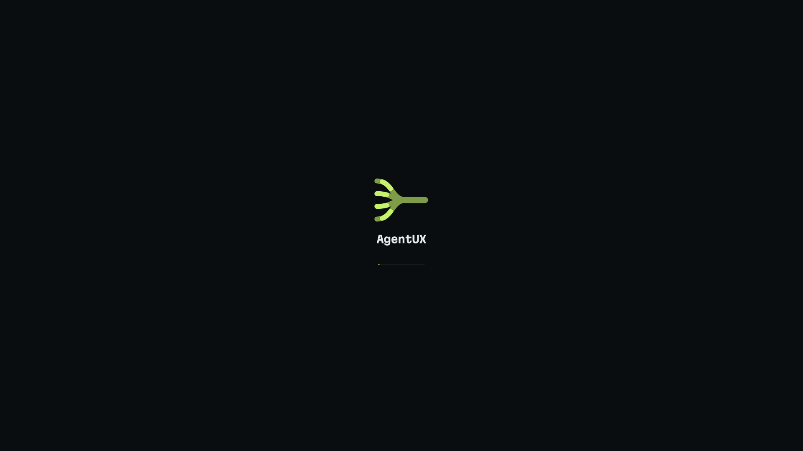
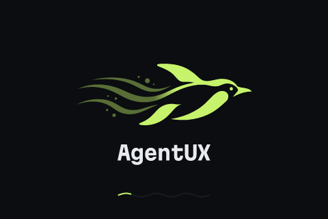
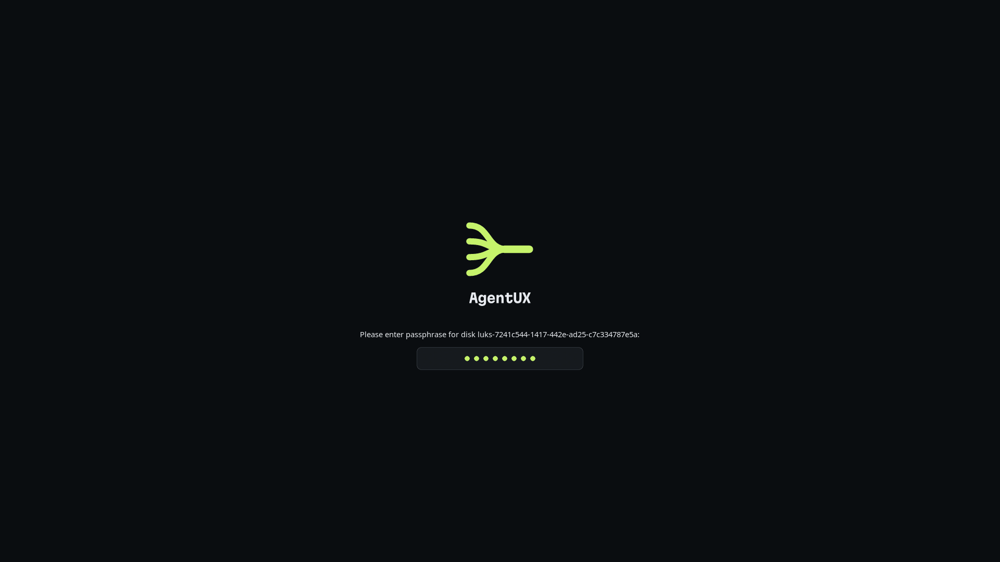

# agentux-os

The [AgentUX](https://github.com/agentux-os/agentux) Linux distribution image: a [bootc](https://containers.github.io/bootc/) image on Fedora Atomic (Kinoite, KDE Plasma), defined by a single `Containerfile` and built by CI for **x86_64 (amd64) and aarch64 (arm64)**.

> **Status:** bootstrapping. See [ADR 0001](https://github.com/agentux-os/agentux/blob/main/docs/adr/0001-linux-distribution-on-fedora-atomic.md) for the design.

## Variants

The one `Containerfile` builds two images, chosen by the build argument `VARIANT`:

| Image | `VARIANT` | Desktop |
|---|---|---|
| `ghcr.io/agentux-os/agentux` | `plasma` (default) | KDE Plasma, the AgentUX defaults described below |
| `ghcr.io/agentux-os/agentux-hyprland` | `hyprland` | The same system plus a Hyprland session, which the login screen preselects; Plasma stays installed and selectable |

Both are multi-arch, signed and checked the same way, and either can `bootc switch` to the other. See [Hyprland](#hyprland) for what the second one adds.

## Architectures

`ghcr.io/agentux-os/agentux` is a multi-arch image: each tag is a manifest list with a `linux/amd64` and a `linux/arm64` image, and `podman pull`, `bootc switch` and `bootc upgrade` pick the one for the machine they run on. CI builds each natively (GitHub's `ubuntu-24.04` and `ubuntu-24.04-arm` runners, no emulation) from the same `Containerfile`, which installs the AgentUX RPMs for the build's architecture (`uname -m`). The arm64 image targets UEFI machines that Fedora supports on aarch64 (SystemReady servers and workstations, VMs on Apple silicon or Ampere hosts); boards that need their own firmware or kernel are not covered.

## What the image contains

- **Base:** Fedora Kinoite — immutable `/usr`, atomic updates, previous image always bootable for rollback.
- **System toolchain:** `git`, `gh`, `ripgrep`, `fd`, `jq`, `bat`, `delta`, `just`, `uv`, Node.js, `mise`, Podman, Distrobox.
- **Coding agent CLIs:** Claude Code, Codex, OpenCode and Antigravity CLI, plus their [ACP](https://agentclientprotocol.com) adapters, installed per user on first login so each can keep itself up to date (`agentux-first-login.service` waits for NetworkManager to be online and, if a download fails, retries every 5 minutes, at most 4 times per hour, then again on the next login). Every step has a time budget (5 minutes per CLI) and every download a connect timeout and stall detection, and the unit's `TimeoutStartSec` (35 minutes) bounds the whole run, so a stuck server or vendor installer is killed and retried instead of hanging first login. Antigravity's ACP server (`agy-acp-server`, ~334 MB, ~1 GB unpacked) is not part of it: `agentux-antigravity-acp.service` installs it afterwards at idle CPU and I/O priority, so the CLIs are ready first. `/etc/profile.d/agentux.sh` puts `~/.local/bin` and mise's shims on every login shell's `PATH`.
- **AgentUX:** from [agentux-core](https://github.com/agentux-os/agentux-core), the `aux` CLI and the `agentuxd` daemon, which runs as a systemd user service enabled for every user (`systemctl --global enable agentuxd.service`, socket at `$XDG_RUNTIME_DIR/agentux/agentuxd.sock`; the packaged unit's `ConditionUser=!@system` keeps it out of system users' sessions, like the first-boot wizard's); from [agentux-desktop](https://github.com/agentux-os/agentux-desktop), the AgentUX Cockpit (`agentux-cockpit`) and the Plasma 6 defaults: the AgentUX global theme, wallpaper, login screen, panel layout, Meta+A / Meta+Return shortcuts and cockpit autostart (which skips system users, so nothing opens over the first-boot wizard), with Fedora's Welcome Center no longer opened at first login, all as system-wide defaults that each user can override.
- **User environment:** `/usr/lib/environment.d/60-agentux.conf` puts `~/.local/bin` and mise's shims on the `PATH` of the systemd user manager too, so user services (`agentuxd` and the agent CLIs it starts) and apps launched from Plasma (the cockpit) find the per-user tools, not only login shells.
- **Boot splash:** the AgentUX Plymouth theme, in the initramfs and on by default (see [Boot splash](#boot-splash)).
- **Identity:** the system calls itself AgentUX (see [Identity](#identity)).
- **First-boot wizard background:** Fedora's `Default` wallpaper is AgentUX's (see [Default wallpaper](#default-wallpaper)).

## Identity

`/usr/lib/os-release` (`/etc/os-release` links to it) names the system AgentUX, as Universal Blue images do for theirs, so the first-boot wizard says "Powered by AgentUX", and the boot menu, `hostnamectl` and KDE's About this System show `AgentUX <date> (Fedora Linux 44 base)` with the AgentUX logo:

| Field | Value | Why |
|---|---|---|
| `NAME`, `PRETTY_NAME`, `VERSION` | `AgentUX`, `AgentUX <YYYYMMDD> (Fedora Linux 44 base)`, `<YYYYMMDD> (Fedora Linux 44 base)` | What people see. The date is the build's, as in the dated image tag; `--build-arg AGENTUX_VERSION=…` overrides it |
| `IMAGE_ID`, `IMAGE_VERSION` | `agentux`, `<YYYYMMDD>` | systemd's fields for image-based systems |
| `VARIANT`, `VARIANT_ID` | `Plasma`, `agentux` | |
| `LOGO` | `agentux` | The brand's app icon, installed as `agentux` in `hicolor` (16–256 px and scalable) and `/usr/share/pixmaps` |
| `HOME_URL`, `DOCUMENTATION_URL`, `SUPPORT_URL`, `BUG_REPORT_URL` | the agentux-os repositories | |
| `DEFAULT_HOSTNAME` | `agentux` | Hostname when none is set |
| `ANSI_COLOR` | Lime | systemd prints the name in it at boot |
| `ID`, `VERSION_ID`, `CPE_NAME`, `SUPPORT_END` (and `PLATFORM_ID`, which Fedora 44 does not set) | Fedora's (`fedora`, `44`, …), unchanged; the base image's os-release is kept as `/usr/share/agentux/os-release.base` and the build and tests compare against it | Tools key on these: bootc-image-builder picks its Fedora definitions by `ID`/`VERSION_ID`, dnf5 resolves `$releasever` from `VERSION_ID`, toolbox picks `fedora-toolbox:<VERSION_ID>` by `ID`, vulnerability scanners map `CPE_NAME` to Fedora's advisories. All of that is still true of this system, so they stay Fedora's (Bluefin and Aurora change `ID` and set `ID_LIKE=fedora` instead, and carry workarounds for it). Fedora sets no `ID_LIKE` |
| `REDHAT_BUGZILLA_PRODUCT*` | removed | Bug reports about this image belong to AgentUX, not Fedora's Bugzilla |

[`/etc/xdg/kcm-about-distrorc`](files/etc/xdg/kcm-about-distrorc) replaces Fedora's (which pointed at Fedora's logo) for KDE's About this System: the AgentUX logo, the AgentUX website, and `VERSION` instead of `VERSION_ID` next to the name. The build fails if the Fedora fields changed or the icon is missing; the smoke and boot tests check the fields again.

## Default wallpaper

plasma-setup's first-boot wizard does not follow the AgentUX theme: a Fedora patch hard-codes its background to `/usr/share/wallpapers/Default/contents/images_dark/` (`images/` with a light theme), `5120x2880.jxl` on a landscape screen and `1440x2960.jxl` on a portrait one. In Fedora, `Default` (and `Fedora`, which points at it) is a symlink owned by `desktop-backgrounds-kde` to the current release's wallpaper package (`F44`). The image points `Default` at `/usr/share/wallpapers/AgentUX-Default/` instead, a wallpaper package with exactly those four files, rendered during the build with ImageMagick (from the base image, built with librsvg and libjxl) from the brand's key art in [`wallpaper/`](wallpaper) (`brand/art/wallpaper-{dark,light}.svg` in [agentux](https://github.com/agentux-os/agentux/tree/main/brand)); the portrait one is a crop around the penguin. So the wizard, and anything else that falls back to `Default`, shows AgentUX's art; `F44` itself is untouched and still selectable. The desktop, lock and login screens keep using the `AgentUX` package from agentux-desktop. The build fails if any of the four files is not a JPEG XL of its size or `Default` stops resolving to them, and the smoke test checks the links again.

Since the symlink belongs to `desktop-backgrounds-kde`, `rpm -V desktop-backgrounds-kde` reports `....L....  /usr/share/wallpapers/Default`; that is expected.

## Hyprland

`ghcr.io/agentux-os/agentux-hyprland` is Kinoite with everything above, plus [Hyprland](https://hypr.land) as a second session, **AgentUX Hyprland**, preselected on the login screen. It is built on Kinoite rather than a minimal Fedora base on purpose: everything AgentUX ships (the cockpit, the Plasma overlay, plasma-setup's first-boot wizard, the login screen, the boot test) keeps working unchanged, KDE apps and settings are there when needed, and Plasma is one click away on the login screen. The cost is size (the KDE stack stays in the image) and two desktops in one system.

- **Packages:** Hyprland, hyprlock, hypridle, hyprpolkitagent, xdg-desktop-portal-hyprland and hyprland-qt-support from the [sdegler/hyprland](https://copr.fedorainfracloud.org/coprs/sdegler/hyprland/) COPR (Fedora 44 has no Hyprland package; the COPR builds for x86_64 and aarch64; its repository file is left disabled in the image); Waybar, fuzzel (launcher), mako (notifications), foot (terminal), swaybg, cliphist, grim/slurp and nm-applet from Fedora.
- **Session:** `/usr/share/wayland-sessions/agentux-hyprland.desktop` runs `/usr/libexec/agentux/hyprland-session`, which seeds the configuration (below) and starts `start-hyprland`. `/usr/lib/plasmalogin/plasmalogin.conf.d/60-agentux-hyprland.conf` preselects it (`[Greeter] PreselectedSession`), which wins over the last session used; to default to Plasma again, choose it under System Settings > Login Screen.
- **Configuration:** Hyprland and its tools read only `~/.config`, so the session copies every file under `/usr/share/agentux/hyprland/user/` to the same path in `~/.config` when the user does not have it yet (and replaces a `hyprland.conf` that Hyprland generated itself). `~/.config/hypr/hyprland.conf` is a stub that `source`s `/usr/share/agentux/hyprland/hyprland.conf`, so the defaults follow image updates and anything the user adds below the `source` line wins; `hyprlock.conf`, `hypridle.conf`, Waybar's `config.jsonc` and `style.css`, mako's, fuzzel's and foot's configs are full copies the user owns. All in the AgentUX colours (Lime on Ink), with the brand wallpaper (`/usr/share/agentux/hyprland/wallpaper.png`, rendered at 3840 × 2160 from `brand/art/wallpaper-dark.svg` in the agentux repository; the Plasma overlay's wallpaper is an SVG, which hyprlock cannot load).
- **Layout:** the master layout, tuned for watching several agents: the cockpit, opened at login, holds the large master area on the left and every new window (agent terminals, logs) stacks on the right.
- **Keys:** `Super+A` focuses the cockpit (or opens it), `Super+Return` a terminal (foot), `Super+Space` / `Super+D` the launcher, `Super+Q` closes, `Super+F` fullscreen, `Super+V` float, `Super+M` swaps the focused window into the master area, `Super+O` moves the master area (left, top, right, centre), `Super+[` / `Super+]` resize it, `Super+arrows` / `Super+H/J/K/L` focus (with `Shift`, move), `Super+1`…`0` workspaces (with `Shift`, move the window), `Super+Shift+V` clipboard history, `Super+Escape` lock, `Print` screenshot of a region to the clipboard, `Super+Shift+E` log out.
- **Agents in the bar:** Waybar's `custom/agents` module, next to the AgentUX button, runs `/usr/libexec/agentux/waybar-agents` every 5 seconds (or on `pkill -RTMIN+8 waybar`). It reads `aux ps --json` from the user's `agentuxd` and shows `agents N` (active runs), `agents N · M waiting` on Lime when approvals or agents' questions wait for you, and `agents off` when the daemon is not reachable; the tooltip lists the runs and the requests, and a click opens the cockpit. The JSON form is stable (agentux-core `docs/api.md`, "aux ps --json"); the script says `agents ?` if aux fails in any other way. The smoke test runs it with no daemon and against `aux daemon --fake-agents` with a run waiting for plan approval.
- **Idle:** hypridle locks with hyprlock after 10 minutes and before suspend, and turns screens off after 15.

The build fails if the defaults stop parsing (`Hyprland --verify-config`, `foot --check-config`, `jq` on Waybar's config); the smoke test runs the same checks on a fresh user's seeded `~/.config`. The boot test covers the Plasma image only.

### AgentUX versions

The AgentUX components are installed from their GitHub releases, pinned in one place, the `ARG`s at the top of the AgentUX section of the [`Containerfile`](Containerfile). The image currently ships agentux-core 0.4.2 and agentux-desktop 0.4.3.

| Pin | What it selects |
|---|---|
| `AGENTUX_CORE_VERSION` | `agentux-<version>-1.fc44.<arch>.rpm` from agentux-core's `v<version>` release |
| `AGENTUX_DESKTOP_VERSION` | `agentux-cockpit-<version>-1.<arch>.rpm` and `agentux-plasma-<version>.tar.gz` (the same for both architectures) from agentux-desktop's `v<version>` release |
| `AGENTUX_PLASMA_SHA256` | sha256 of that Plasma tarball; the build fails if the download doesn't match |

`<arch>` is the build's `uname -m`, `x86_64` or `aarch64`; any other architecture fails the build. Both RPMs go through `dnf install`; the Plasma tarball (paths relative to `/`, only `usr/` and `etc/`) is extracted over `/` after the checksum check. To move to newer releases, run `just bump-agentux` (needs an authenticated `gh`): it takes the newest non-draft release of each repo, pre-releases included, checks that both releases have the `x86_64` and `aarch64` RPMs, rewrites the three pins from them (the checksum comes from the release's `.sha256` asset) and shows the diff to commit. A build with other versions without editing the file: `podman build --build-arg AGENTUX_CORE_VERSION=� .`. If a release ever changes the RPM's release number or Fedora tag (`-1.fc44`), update the file name in the `Containerfile` by hand.

## Boot splash



The boot splash is the brand's swimming penguin on Ink: a band of light runs back along its wake (the water lines and bubbles, drawn at 42 % as in the mark), from the penguin's back to the end of the water, as if the water were streaming past. One more water line under the wordmark, a Lime wave filling a Graphite one, is Plymouth's boot progress. Shutdown and reboot show the same screen with "Shutting down" or "Restarting" instead, and offline updates a progress line with a "don't turn off" note.



If the disk is encrypted, the passphrase prompt (LUKS, from the initramfs) takes the progress line's place, the wake comes to rest while it waits, and "Caps Lock is on" shows under the field when it is:



How it is built:

- The theme is [`files/usr/share/plymouth/themes/agentux/`](files/usr/share/plymouth/themes/agentux/), for Plymouth's script plugin (`plymouth-plugin-script`, which the image adds): [`agentux.script`](files/usr/share/plymouth/themes/agentux/agentux.script) and ~190 KB of PNGs. Everything is sized for 1080p and scales with the screen; each image comes at 1x and @2x, so 4K screens get sharp ones. It lays the screen out again when a display changes (the firmware framebuffer handing over to the GPU driver). The firmware's logo is not kept: the splash replaces it with the Ink screen.
- [`plymouth/build.py`](plymouth/build.py) draws the PNGs from the penguin's traced geometry (`brand/src/penguin.svg`, the same parts, wake opacity and gradient as the brand's mark) and the brand's `wordmark-mist.svg` (agentux repository, `brand/`) with resvg: `cd plymouth && npm install && python3 build.py`. Edit the script, not the PNGs.
- The `Containerfile` selects the theme (`plymouth-set-default-theme agentux`) and rebuilds the kernel's initramfs, `/usr/lib/modules/$kver/initramfs.img`, which is the one bootc boots: `dracut --no-hostonly --reproducible --add ostree`, as Universal Blue images do. The build fails if the theme or the script plugin is not in it.
- Plymouth shows a splash only when the kernel command line asks for one. Kinoite's image sets no kernel arguments (installers used to add `rhgb quiet`), so [`/usr/lib/bootc/kargs.d/10-agentux-splash.toml`](files/usr/lib/bootc/kargs.d/10-agentux-splash.toml) adds `rhgb quiet`; bootc applies it on install and on the next upgrade. To see boot messages instead, press Esc during boot, or remove them with `sudo rpm-ostree kargs --delete=rhgb --delete=quiet`.

To see it without installing: `python3 plymouth/preview.py` renders the animation from the theme's images (the GIF above), and [`plymouth/preview-vm.sh`](plymouth/preview-vm.sh) builds the `Containerfile`'s splash step on the base image and boots that kernel and initramfs in QEMU (software emulation in a container, no KVM, a few minutes) twice, once plain and once with a LUKS disk and a few keys typed into the prompt, saving a screenshot every half second to `output/plymouth-preview/`. The screenshots above come from it.

## GRUB menu

On an installed system the GRUB menu (shown for a second at every boot; any key stops the countdown) is AgentUX's too: the Ink screen with the swimming penguin under the menu, entries in Slate and the selected one in Lime, in GRUB's own Unifont.

A bootc image cannot ship files into GRUB's reach: GRUB reads only the boot partition, and bootupd writes a static `grub.cfg` there once, at install time (`/usr/lib/bootupd/grub2-static/`), and leaves it alone on updates. That `grub.cfg` sources `$prefix/console.cfg`, "GRUB console settings provided by the user/platform", before it draws the menu, and nothing else on the system writes that file. So:

- the image carries the theme in [`/usr/share/agentux/grub/`](files/usr/share/agentux/grub/): `console.cfg` (load the font, switch to the graphical terminal, set `theme`), `theme.txt`, `background.png` (1920 × 1080, from [`grub/build.py`](grub/build.py) and the brand's mark; cropped to other screen sizes) and GRUB's `unicode.pf2`, copied in at build time;
- [`agentux-grub-theme.service`](files/usr/lib/systemd/system/agentux-grub-theme.service) runs [`/usr/libexec/agentux/grub-theme`](files/usr/libexec/agentux/grub-theme) at every boot, which copies that directory to `/boot/grub2/agentux/` and its `console.cfg` to `/boot/grub2/console.cfg` when they differ from the booted image's (so theme changes arrive with `bootc upgrade`). It never touches `grub.cfg`, the boot entries or `grubenv`, so updates and rollbacks work as before; a rollback to an older image keeps the last theme, which is harmless;
- `console.cfg` is yours as much as AgentUX's: the service writes it only when there is none or when it is still exactly what it wrote last time. Edit or delete it (and `/boot/grub2/agentux/`) to get GRUB's plain menu back, or put console settings of your own in it, and the service leaves it alone. If the graphics or a file fail to load, GRUB keeps its text menu;
- the build fails if bootupd's static config stops sourcing `console.cfg`, and the boot test checks that the service ran and the files on `/boot` match the image.

The live ISO's menu is Titanoboa's: it generates the ISO's `grub.cfg` from the entries in `iso.yaml` with no way to add a theme or source another file, so it stays GRUB's text menu (with AgentUX's entry names).

## Try it live

The [Live ISO](https://github.com/agentux-os/agentux-os/actions/workflows/live.yml) workflow builds a live ISO: boot it from a USB stick or in a VM and AgentUX runs from RAM, without touching the disk, and installs from there when you want to keep it. Download `agentux-live-<date>-x86_64.iso` from the artifacts of a successful run (weekly, on tags, or run the workflow; `hyprland` builds `agentux-hyprland-live-…`, `arm64` an aarch64 ISO, which CI builds but cannot boot-test), check it against its `.sha256` and write it to a USB stick as above. It boots with UEFI (no legacy BIOS); give a VM at least 4 GB of RAM, 8 GB is comfortable.

What you get:

- **The real desktop.** The live system is the published image plus a thin live layer: GRUB's "Try or install AgentUX" entry logs a passwordless `liveuser` straight into Plasma (or the AgentUX Hyprland session on the hyprland ISO) with the AgentUX theme, wallpaper, panel and cockpit, as on an installed system.
- **A demo with fake agents.** Agent CLIs need vendor logins, so the live session's `agentuxd` runs with `--fake-agents`, a scripted stand-in that answers every agent step. At login it sets up `~/agentux-demo`, a small project whose `agentux.yaml` mirrors the default pipeline (Claude Code plans, OpenCode implements, Codex reviews), and starts two runs: one already approved, which runs through the gate and review to its pull request, and "Add a /health endpoint", which waits in the cockpit's inbox for you to approve its plan. A note on the desktop explains it; `aux ps` and `aux watch <run>` work in a terminal too.
- **No downloads at login.** On an installed system first login downloads the agent CLIs and Antigravity's ACP server (together over 1 GB); live, they would sit in RAM. The live session does not start `agentux-first-login.service` at login: **Install the agent CLIs** on the desktop starts it on demand. `agentux-antigravity-acp.service` never runs live (a drop-in adds `ConditionKernelCommandLine=!rd.live.image`).
- **Install AgentUX** (desktop, panel and menu) opens Anaconda's web installer, in AgentUX's colours with the mark in its title bar. You pick the language, keyboard and disk; the account is created by the first-boot wizard (plasma-setup) when the installed system starts, as on Fedora Kinoite. It installs `ghcr.io/agentux-os/agentux:latest` (`agentux-hyprland` from the hyprland ISO) **from the registry**, so it needs an internet connection (the launcher checks first and says so; use the installer ISO to install offline). The pull goes through the image's own signature policy, so only an image signed with the AgentUX key installs, and the installed system tracks `:latest` exactly as one installed from the installer ISO (`bootc switch --mutate-in-place --transport registry`, as bootc-image-builder's installer does). Nothing from the live session is installed: it is not the live root that gets copied.

How it is built: [`live/Containerfile`](live/Containerfile) starts from the published image and runs [`live/build.sh`](live/build.sh), which adds everything live-only; [Titanoboa](https://github.com/ublue-os/titanoboa) (Universal Blue's live ISO builder, used for Bazzite's and Bluefin's live ISOs) squashes that image into `LiveOS/squashfs.img` and writes the ISO with its kernel, initramfs and the GRUB entries from `/usr/lib/bootc-image-builder/iso.yaml`. The live layer:

- regenerates the initramfs with dracut's `dmsquash-live` (the AgentUX boot splash stays in it), boots with `rd.live.image` and SELinux permissive (the squashfs carries no labels), and mounts a larger tmpfs on `/var/tmp`;
- adds `livesys-scripts` (the live user, autologin, Fedora's live tweaks), `anaconda-live` with an AgentUX profile and the payload in `/usr/share/agentux/live/install.ks`, and `qemu-guest-agent`;
- brands the web installer: anaconda-webui runs in Cockpit, which takes its logo and colours from `/usr/share/cockpit/branding/<ID>-<VARIANT_ID>/` before `branding/fedora/`, so [`live/cockpit-branding/`](live/cockpit-branding/) goes there (`fedora-agentux` or `fedora-agentux-hyprland`): the compact mark in Lime, an Ink title bar instead of Fedora's blue, Lime buttons on the dark theme and Moss on the light one. The product name in the title bar is os-release's `PRETTY_NAME`, already AgentUX's;
- replaces Fedora's "Install to Hard Drive" with **Install AgentUX** and **Install the agent CLIs**, pins Install AgentUX first in the panel and adds the desktop note;
- runs `agentuxd` with `--fake-agents` (a drop-in on its user unit) and enables `agentux-live-demo.service`;
- disables `agentux-first-login.service` and `agentux-antigravity-acp.service` for all users.

Live mode is visible to scripts as `rd.live.image` on the kernel command line, and `/usr/share/agentux/live/marker` exists only in the live layer. None of it is in the image: an installed system has none of these files.

## Install

### From the ISO

The [Build ISO](https://github.com/agentux-os/agentux-os/actions/workflows/iso.yml) workflow turns the latest image into an Anaconda installer ISO per architecture with [bootc-image-builder](https://github.com/osbuild/image-builder/tree/main/bootc-image-builder), each built natively: `agentux-<date>-x86_64.iso` for PCs and `agentux-<date>-aarch64.iso` for 64-bit ARM UEFI machines. Download the one for your machine from the artifacts of a successful run, check it against the `.sha256` next to it, and write it to a USB stick:

```sh
sha256sum -c agentux-*.iso.sha256
sudo dd if=agentux-<date>-<arch>.iso of=/dev/sdX bs=4M status=progress oflag=sync
```

On ARM, boot the aarch64 ISO through the machine's UEFI firmware (or attach it as the CD of an aarch64 UEFI VM, e.g. UTM or Parallels on Apple silicon, or QEMU with `qemu-efi-aarch64`/`edk2-aarch64`).

The installer is interactive: you pick the disk, language and time zone and create your account. The installed system tracks `ghcr.io/agentux-os/agentux:latest` and updates from it.

This installer still looks like Fedora's (logo, blue title bar): bootc-image-builder assembles its environment from Fedora's packages (`fedora-logos`, `fedora-release`), and its configuration (`[customizations.installer]`: kickstart, Anaconda modules, unattended, sudo, menu timeout, Flatpak payload; `[customizations.iso]`: volume ID, publisher, application ID) offers no logo, product name or theme. The live ISO's installer is the branded one.

### From an existing Fedora Atomic or bootc system

Switch to the latest image:

```sh
sudo bootc switch ghcr.io/agentux-os/agentux:latest
systemctl reboot
```

The same command works on x86_64 and aarch64: the tag is a manifest list and bootc pulls the image for the running architecture. Roll back with `sudo bootc rollback`.

## Verifying the image

Every image CI publishes is signed twice with [cosign](https://github.com/sigstore/cosign) before `:latest` moves to it, on every digest it publishes: the manifest list and the amd64 and arm64 images in it (a system checks the signature of the image for its architecture, not the list's):

- **keyless**, with the GitHub Actions identity of the build workflow on `main` (Fulcio certificate, recorded in the Rekor transparency log);
- with the **AgentUX signing key**, whose public half is in this repository and in the image at [`/etc/pki/containers/agentux-os.pub`](files/etc/pki/containers/agentux-os.pub).

Check either from any machine:

```sh
cosign verify ghcr.io/agentux-os/agentux:latest \
  --certificate-identity-regexp '^https://github\.com/agentux-os/agentux-os/\.github/workflows/build\.yml@refs/heads/main$' \
  --certificate-oidc-issuer https://token.actions.githubusercontent.com

cosign verify --key files/etc/pki/containers/agentux-os.pub ghcr.io/agentux-os/agentux:latest
```

That checks the list. To check one architecture's image, verify its digest from the list, e.g. for arm64:

```sh
digest="$(skopeo inspect --raw docker://ghcr.io/agentux-os/agentux:latest \
  | jq -r '.manifests[] | select(.platform.architecture == "arm64") | .digest')"
cosign verify --key files/etc/pki/containers/agentux-os.pub "ghcr.io/agentux-os/agentux@$digest"
```

### On installed systems

An installed system checks the key signature itself on every `bootc upgrade` and `bootc switch`, because the image ships:

- `/etc/containers/policy.json` with two entries added to Fedora's, the same in both images: `ghcr.io/agentux-os/agentux` and `ghcr.io/agentux-os/agentux-hyprland` each require a `sigstoreSigned` signature by `/etc/pki/containers/agentux-os.pub` (identity `matchRepository`, since cosign signs repositories, not tags). Every other registry keeps Fedora's rules, including the `insecureAcceptAnything` default.
- `/etc/containers/registries.d/agentux-os.yaml`, which turns on `use-sigstore-attachments` for `ghcr.io/agentux-os` so the signature is fetched from the registry.

An update that is unsigned or signed by another key is refused before any layer is downloaded, and the system stays on what it runs. The policy checks the key signature, not the keyless one: containers/image only matches Fulcio certificates by e-mail, and GitHub Actions certificates carry a workflow URI.

Systems installed from an image older than the signing change have no such policy yet. Nothing special is needed: the next `sudo bootc upgrade` brings an image with the policy (that one pull is not checked), and every pull after it is. If you changed `/etc/containers/policy.json` yourself, `/etc` keeps your version on updates; check that the entry is there:

```sh
jq '.transports.docker["ghcr.io/agentux-os/agentux"]' /etc/containers/policy.json
```

and add it by hand if it is not. Do not use `bootc switch --enforce-container-sigpolicy`: it refuses any policy whose default is `insecureAcceptAnything`, which Fedora's is; the per-repository entry above is what enforces the signature.

CI checks the policy the same way a system would: after signing, it runs the image's own `skopeo` with the image's own policy, registries.d and key ([`tests/sigpolicy.sh`](tests/sigpolicy.sh)), once per architecture (`skopeo --override-arch`, so it picks that architecture's image from the list as a system of that architecture would), against the signed list's digest and tag, which must pass, against an unsigned image pushed to `:ci-unsigned` in the same repository, which must be refused for lack of a signature, and against an image from another registry, which must still pass; it also checks that the policy requires the AgentUX key for both repositories. This runs for each variant's repository (`publish (plasma, agentux)`, `publish (hyprland, agentux-hyprland)`). If any of that fails, neither `:latest` nor the dated tag moves: each architecture's image is pushed first under a staging tag (`ci-staging-amd64`, `ci-staging-arm64`), the list under `ci-staging`, and the public tags are copied from the list's digest, unchanged, only after every check passed. To try the publishing path from a branch, run `gh workflow run build.yml --ref <branch>`: it pushes, signs and checks `test-<sha>` (the list) and `test-<sha>-amd64` / `test-<sha>-arm64` only.

The required check, `build`, passes when both variants built for both architectures and, outside pull requests, both lists were published; the per-image jobs are `image (plasma, amd64)`, `image (plasma, arm64)`, `image (hyprland, amd64)` and `image (hyprland, arm64)`, and the smoke tests `smoke (<variant>, <arch>)`.

Every job that builds or pulls an image first pulls it with [`.github/scripts/pull.sh`](.github/scripts/pull.sh), which retries up to five times with a growing pause: quay.io's CDN drops a blob download halfway now and then (`writing blob: ... unexpected EOF`), and podman's own few quick retries used to give up and fail the whole build. `podman build` then starts from the local copy of the base image.

The signing key lives in the repository secrets `COSIGN_PRIVATE_KEY` and `COSIGN_PASSWORD`. Rotating it means shipping the new public key in an image signed with the old one first (a `keyPaths` list with both), then switching CI to the new key.

## Build and test locally

You need Linux with Podman and [`just`](https://just.systems); `vm` also needs QEMU with KVM and OVMF.

```sh
just build        # podman build -> localhost/agentux:dev (just build hyprland for the Hyprland variant)
just iso          # installer ISO from that image -> output/bootiso/install.iso (uses sudo)
just vm           # install the ISO into a VM disk, output/vm-disk.qcow2
just vm disk      # boot the installed VM disk
just live         # live ISO from the published image -> output/live/*.iso (just live localhost/agentux:dev for your build; uses sudo)
just live-test    # boot that ISO headless and run the live test, like CI (output/live-test/)
just smoke        # real first login in a container of the image, then check every tool resolves
just lint         # shellcheck + hadolint, the same checks as CI
just bump-agentux # move the AgentUX pins to the latest releases (see above)
```

CI runs the same smoke test (`tests/smoke.sh`) on every pull request, on amd64 and arm64: it builds the image, runs it as a container, creates a regular user, runs `first-login` for real, bounded by its unit's `TimeoutStartSec` (it fails if first-login does not finish within it, and each step's result and duration go into the job summary), and checks from a clean login shell (`bash -lc`) that `claude`, `opencode`, `agy`, `codex`, `bun`, `lazygit`, `ast-grep` and `yq` print a version, that the first-login marker exists and that the system toolchain is on `PATH`. For AgentUX it checks that `aux`, `agentuxd` and `agentux-cockpit` are installed and `aux --version` / `agentuxd --version` run, that the Plasma theme is in place and selected in `/etc/xdg/kdeglobals`, that `agentuxd`, first-login and the Antigravity ACP server's unit are enabled for all users, starts `agentuxd` as the test user with a temporary `XDG_RUNTIME_DIR` and runs `aux ps` against it, and resolves the user manager's environment with `systemd-environment-d-generator` to check that `PATH` starts with `~/.local/bin` and mise's shims. The ACP adapters (`claude-agent-acp`, `codex-acp`) and Antigravity's ACP server (`agy-acp-server`, a ~1 GB download resolved from the [ACP registry](https://github.com/agentclientprotocol/registry)) are optional: first-login installs the adapters when it can, the smoke test then installs the ACP server the way its unit does, and it only warns if any of them is missing or the ACP server's install fails or times out.

### Boot test

The smoke test never boots anything. The [Boot test](https://github.com/agentux-os/agentux-os/actions/workflows/boot.yml) workflow does: nightly against `ghcr.io/agentux-os/agentux:latest`, on demand, and on pull requests that touch the `Containerfile`, `files/` or the boot test itself (it is not a required check: it takes about an hour and needs the network inside the VM). It runs on amd64 and, where the runner has KVM, arm64 (GitHub's arm64 runners may not expose `/dev/kvm`; without it the arm64 leg reports that it skipped, since a whole Plasma boot under emulation would take hours). It builds a qcow2 with bootc-image-builder whose config adds a `boottest` user with an SSH key and password made for that run (and `systemd.wants=sshd.service` on the kernel command line, since Kinoite does not enable sshd), boots it headless under QEMU/KVM with UEFI (OVMF), and runs [`tests/boot.sh`](tests/boot.sh) over SSH:

- `bootc status` shows the expected image booted, and `systemctl --failed` is empty, for the system and the user manager;
- the boot splash is selected (`plymouth-set-default-theme` says `agentux`), the initramfs the system booted with has it and the script plugin (`lsinitrd`), and the kernel command line has `rhgb`;
- with linger enabled, `agentux-first-login.service` completes within its `TimeoutStartSec` (its CPU time, wall clock time, memory peak and each step's result and duration go into the run summary), `agentux-antigravity-acp.service` runs after it at low priority (reported the same way, warnings only), and every agent CLI and dev tool runs as a transient user service (`systemd-run --user`), i.e. with the user manager's `PATH`;
- in the first-boot wizard's session (the system user `plasma-setup`), the cockpit's autostart unit logs that it skips system users and exits successfully, nothing failed, and neither the cockpit, `agentuxd` nor first-login runs for it;
- the login screen defaults (`/usr/lib/plasmalogin/plasmalogin.conf.d/50-agentux.conf`) and the cockpit's autostart wrapper are installed, and `/etc/xdg/kded5rc` turns off the Welcome Center's kded module;
- `aux --version` reports the pinned agentux-core version, `agentuxd.service` is active, has `~/.local/bin` on its `PATH`, and `aux ps` talks to its socket;
- a second daemon with fake agents (`aux daemon --fake-agents` on a temporary socket) takes a run through plan approval, implement, a gate check and a pull request;
- `aux validate` shows a project with `isolation: {mode: podman}` running its checks in Podman, and the fake-agents daemon takes such a project through a gate whose check runs in rootless Podman ([ADR 0009](https://github.com/agentux-os/agentux/blob/main/docs/adr/0009-container-isolation-for-checks.md)); that run only warns if it fails, with the daemon log, Podman's state and SELinux denials.

Then it ends the wizard session with a display manager drop-in without autologin and screenshots the login screen, adds an autologin drop-in (on that VM only), reboots into Plasma (Wayland), checks that `kwin_wayland`, `plasmashell` and `agentux-cockpit` run with the AgentUX look-and-feel, that the cockpit's autostart unit is active, that the Welcome Center neither runs nor was launched and its kded module is not loaded, and takes screenshots through QEMU's monitor: the first boot, the login screen and the desktop. Those desktop checks are reported but do not fail the run. QEMU also takes a screenshot every half second for the first 45 seconds of the first boot and of the reboot (`splash/boot/`, `splash/reboot/` in the artifact), and the summary says whether any of them shows the boot splash; that only warns, since what a VM's screen shows that early depends on the firmware and the driver handover. The test VM's kernel command line has `plymouth.ignore-serial-consoles`, since with a serial console Plymouth would draw only text there. Screenshots, the serial console, `journalctl` for both boots and `bootc status` are uploaded as the run's artifact, with a summary on the run page.

Locally, `just boot-test` does the same with the image from `just build` (results in `output/boot-test/`).

### Live ISO test

The Live ISO workflow boots the amd64 ISO it built (on pull requests that touch `live/`, the live test or the workflow, weekly and on tags) headless in QEMU/KVM with UEFI, from the CD, with an empty disk behind it, and talks to the live system through the QEMU guest agent the live layer ships ([`tests/live-vm.sh`](tests/live-vm.sh), which runs [`tests/live.sh`](tests/live.sh) in the VM as root):

- it waits for the live user's autologin session, then checks that the system booted live (`rd.live.image`, the overlay root), that `kwin_wayland`, `plasmashell` and `agentux-cockpit` run for `liveuser` with the AgentUX look-and-feel, that `agentuxd` runs with `--fake-agents` and `aux ps` answers with the demo's runs (one waiting for approval), and that neither first-login nor the Antigravity ACP server unit is enabled or ran; the installer launchers, the panel pin and Anaconda's payload are checked too but only warn;
- screenshots: the desktop after login and a minute later, the demo after the test approves its waiting run, and the installer opened through **Install AgentUX**; plus a screendump every 2 seconds of the first two minutes (GRUB and the boot splash, `boot/` in the artifact);
- then it installs from the live system to the VM's disk with Anaconda and the live installer's own payload (`install.ks`: the registry pull through the signature policy and the `bootc switch`). Anaconda's live mode takes no kickstart (its interactive defaults only preset values; the disk is always picked in the UI), so the test runs it as a plain kickstart install from the live session, with the answers the UI would get. Anaconda halts the live system at the end, so the test then attaches the VM's disk to the host (`qemu-nbd`) and checks the installed deployment there: it tracks `ghcr.io/agentux-os/agentux:latest` from the registry (`ostree-unverified-registry:`, as after a bootc-image-builder install), has the signature policy and the image's own user units, and no live user, live demo or fake-agents override. Then it boots the disk alone and screenshots its first boot. The install depends on the VM reaching ghcr.io, so a failed install only warns; an installed system that differs from a normal install fails the job. The VM gets 12 GB of RAM for it, since the live system runs in RAM.

`just live-test` does the same locally (`LIVE_TEST_INSTALL=0` skips the install).

`just qcow2 path/to/config.toml` builds a ready-to-boot disk instead (`just vm qcow2` boots it); the config should add a user with `[[customizations.user]]`. Set `AGENTUX_IMAGE` to build from another image, e.g. `AGENTUX_IMAGE=ghcr.io/agentux-os/agentux:latest just iso` after a `podman pull`.

## License

[Apache 2.0](LICENSE)
